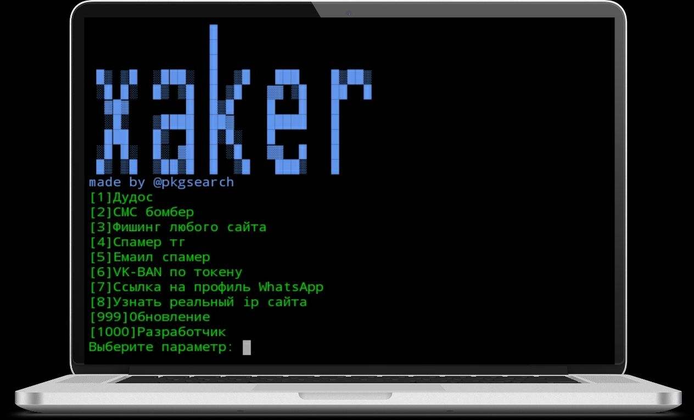
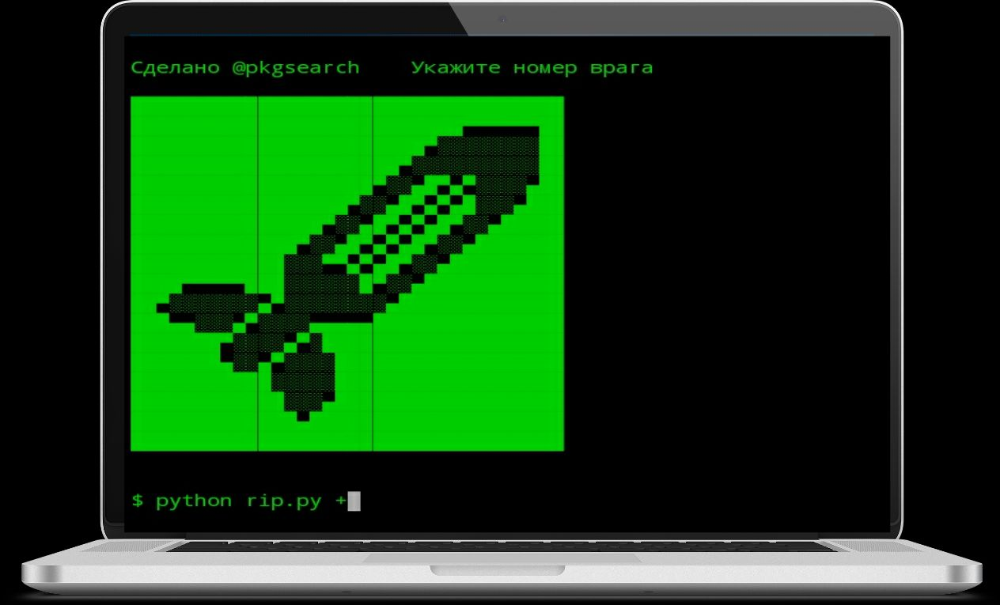
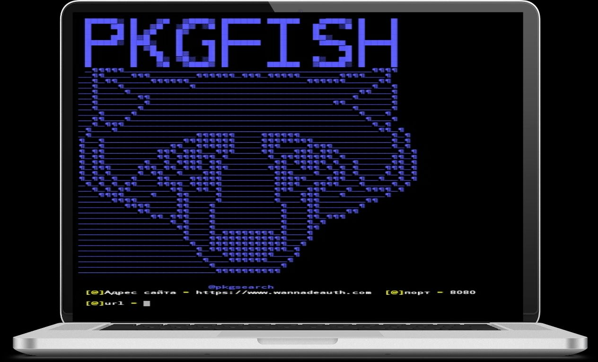
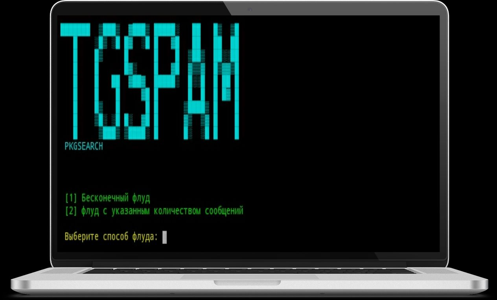
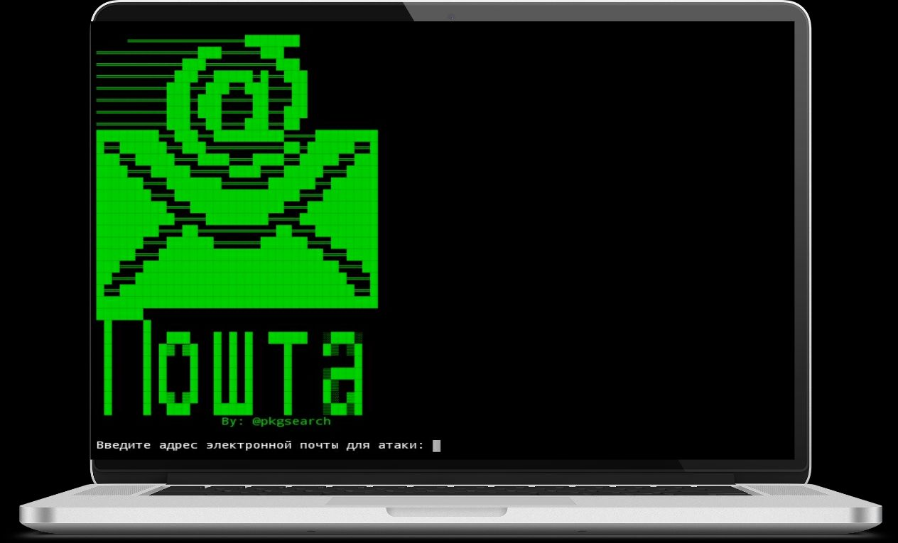
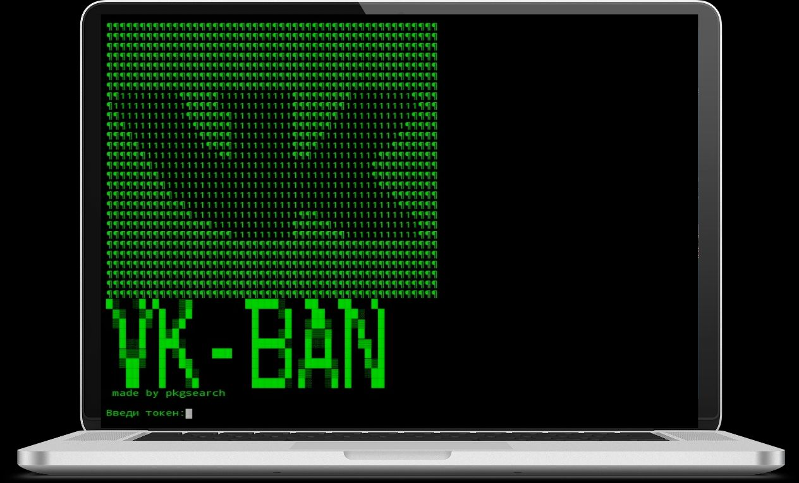
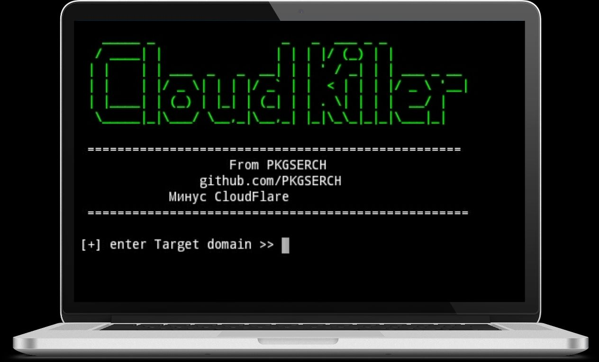

# MXtool

###### Функции:

1. SMS bomber
2. Ddos
3. Tgspam
4. Phishing
5. Email bomber


- Обновление xaker 4.0:
- Добавлены:
  - Ссылка на профиль васап
  - Авто обновление
  - Клауд киллер

##### Установка:

Termux:

```
curl -L kutt.it/txaker | bash
```

Linux (Debian-based):

```
curl -L kutt.it/lxmx | bash
```

Запуск из любой директории:

```
xaker
```

Если не робит (возможно на iPhone и Linux)

```
cd xaker && bash main.sh
```


#### Скрины:











### Веб версия:

Веб версия: https://kutt.it/xaker

1. Заходим по ссылке
2. Нажимаем на "<|" и переходим в "console"
