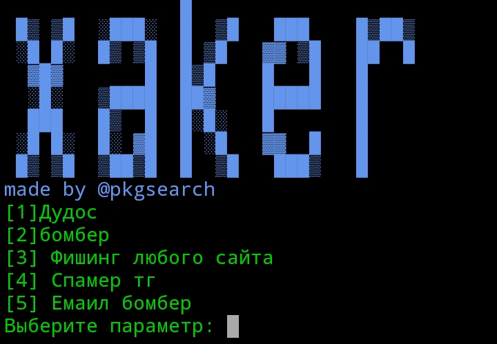

# xaker
###### Уважаемый пользователь! Скрипт лицензирован лицензией MIT. Она говорит что за все действия ответственность несёте вы, и при использование кода должны уведомить меня, и лицензировать той же лицензией.


###### Функционал:
1. SMS bomber  
2. Ddos  
3. Tgspam  
4. Phishing  
5. Email bomber  


- Обновление xaker 3.0:
  + Авто запуск
  + Выкрашен текст
- Добавлены:
  + TELEGRAM SPAM
  + EMAIL BOMBER


##### Установка:
```
curl -LO kutt.it/txaker && bash txaker
```
Запуск из любой директории:
```
xaker
```


#### Скрин:

