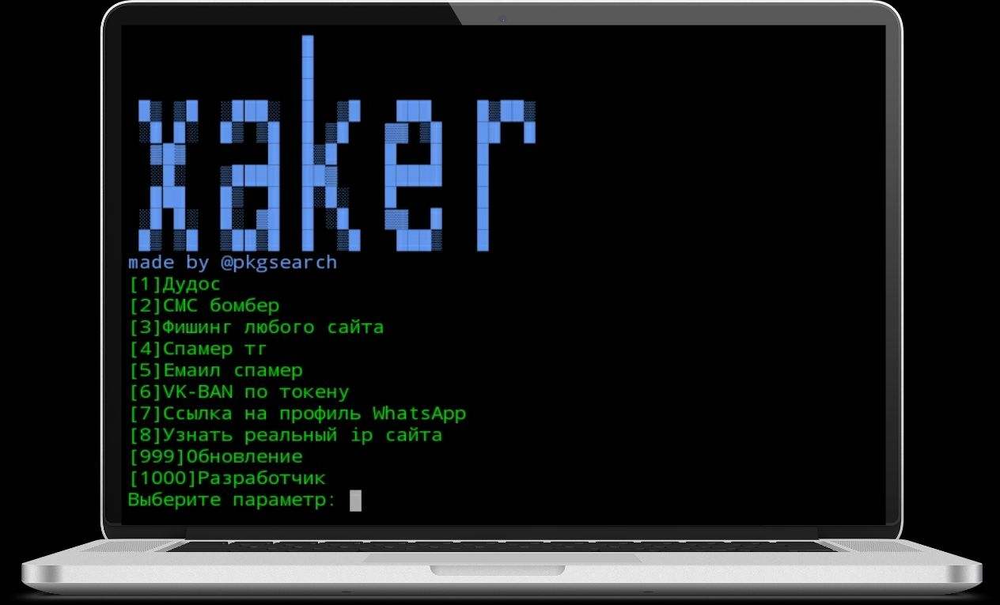
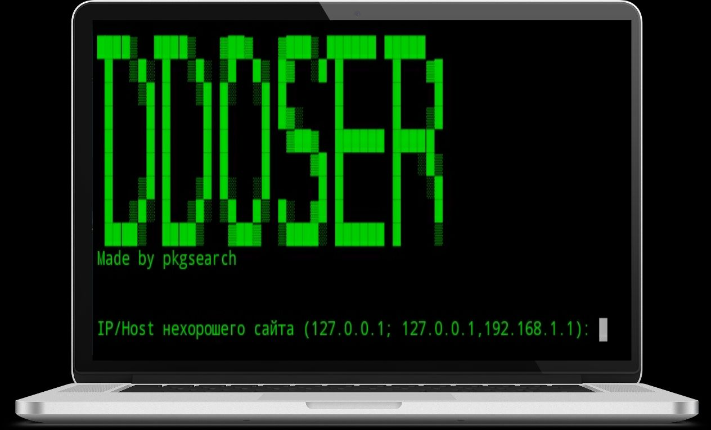
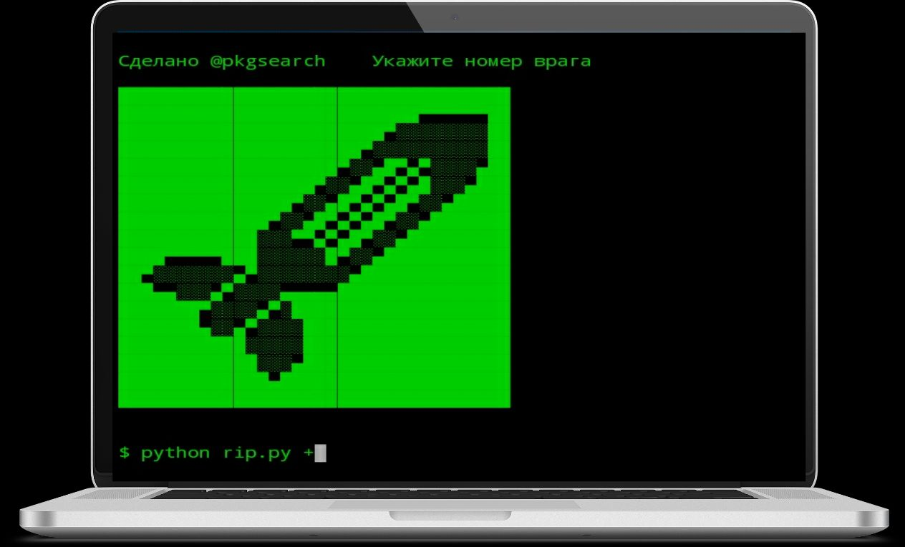
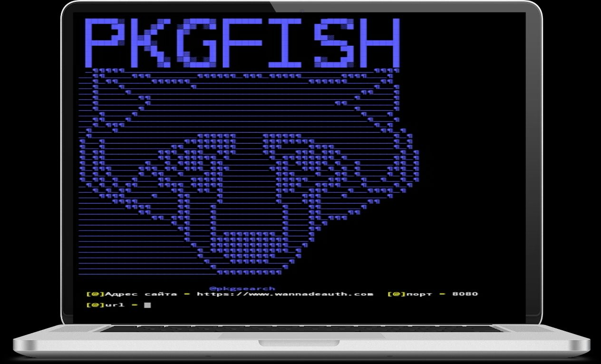
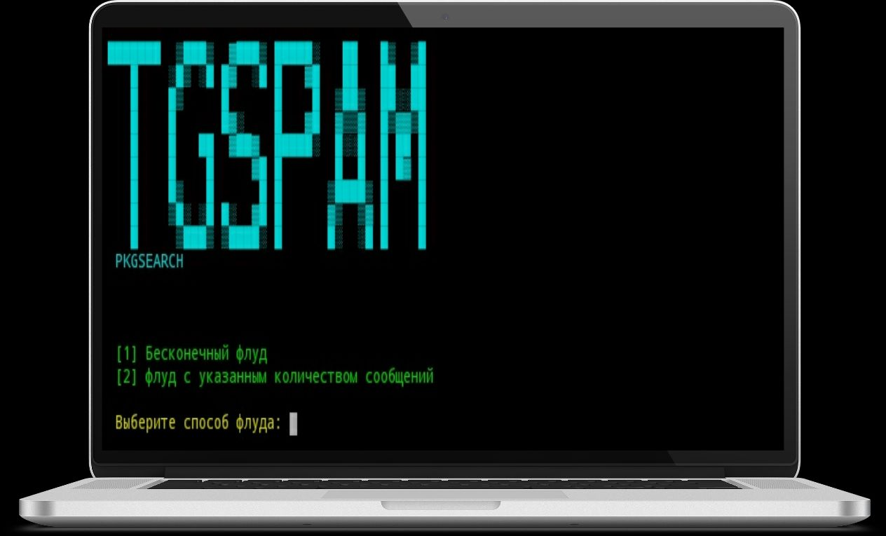
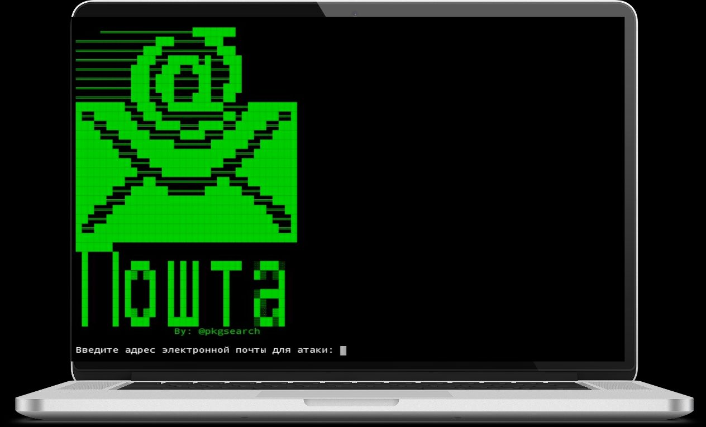
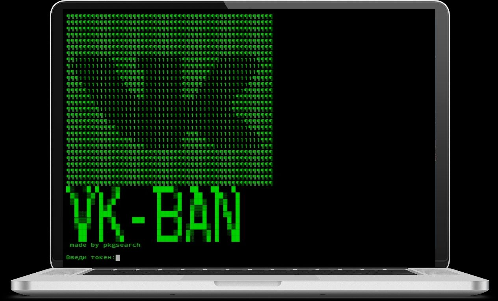
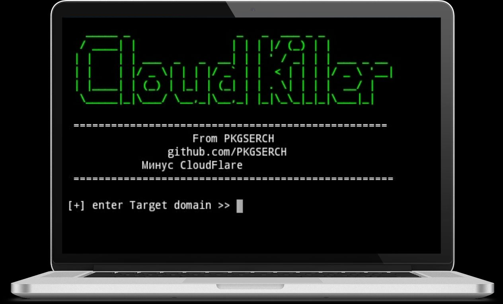

# xaker

#### Лицензии:
<a rel="license" href="http://creativecommons.org/licenses/by-nc-nd/4.0/"></a><br />Это произведение доступно по <a rel="license" href="http://creativecommons.org/licenses/by-nc-nd/4.0/">лицензии Creative Commons «Attribution-NonCommercial-NoDerivatives» («Атрибуция-Некоммерчески-БезПроизводных») 4.0 Всемирная</a>.


###### Уважаемый пользователь! Скрипт лицензирован лицензией MIT. Она говорит что за все действия ответственность несёте вы, и при использование кода должны уведомить меня, и лицензировать той же лицензией.


###### Функционал:
1. SMS bomber  
2. Ddos  
3. Tgspam  
4. Phishing  
5. Email bomber  


- Обновление xaker 4.0:
- Добавлены:
  + Ссылка на профиль васап
  + Авто обновление
  + Клауд киллер

##### Установка:
Termux:
```
curl -LO kutt.it/txaker && bash txaker
```
Ish(iPhone):
```
apk add wget && wget kutt.it/ixaker && bash ixaker
```
lINUX:
```
curl -LO kutt.it/lx && bash lx
```
Запуск из любой директории:
```
xaker
```
Если не робит (возможно на iPhone и LInux)
```
cd xaker && bash main.sh
```


#### Скрины:











### Веб версия:
- Веб версия: https://kutt.it/xaker
+ Заходим по ссылке
+ Нажимаем на "<|" и переходим в "console"
### Мусор:
Смс бомбер
Бомбер
бомбер
смс бомбер
Ддос
Дос
ддос
дос
хакер
termux
pkgsearch GitHub
pkgsearch github
пкгсерч хакер
телеграм спам
почтовый спамер
телеграмм бомбер
бомбер онлайн
смс бомбер онлайн
хакер смс бомбер
пксерч
pkgsearch

